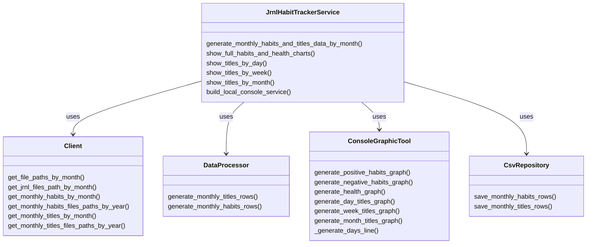

# Jrnl Habit Tracker

Template that would allow you run python scripts.

This includes:

- `Dockerfile`
- `Makefile`
- `src` folder
- Base `logging` config
- Base `lint` config
- Base `secrets` configuration

## How to use this

1. Run `make build` to have a base image
2. Replace all the "replace_me" with the correct values.
3. Add dependencies to the `pyproject.toml`
4. Run `make lock-dependencies` to re build the image
5. Yoy can use the `make terminal` to use a terminal inside the container

## Testing and lint

- `make test` would run all the test on the tests folder
- `make debug test_dir=tests/{file_name}::{test_name}` would allow you to run specific test or files with test
- `make lint` would run `pylint` to find improvements on your code
- `make black` to run `black` and formate your code

## Environment Variables

The following environment variables are required for the project:

- `PYTHONDONTWRITEBYTECODE=1`
- `JRNL_DIR="{USE_YOUR_JRNL_DIR}"`

## Project overview

```Jrnl Habit Tracker
Jrnl Habit Tracker
├── Dockerfile
├── Makefile
├── README.md
├── pyproject.toml
├── src
│   ├── client
│   │   └── local_client.py
│   ├── data_processor
│   │   ├── data_processor.py
│   │   └── dto.py
│   ├── graphic_tool
│   │   └── console_graphic_tool.py
│   ├── repository
│   │   └── csv_repository.py
│   └── service
│       └── service.py
└── tests
    ├── unit
    │   ├── client
    │   │   └── test_client.py
    │   ├── data_processor
    │   │   └── test_data_processor.py
    │   ├── graphic_tool
    │   │   └── test_graphic_tool.py
    │   ├── repository
    │   │   └── test_repository.py
    │   └── service
    │       └── test_service.py
    └── integration
        ├── client
        │   └── test_client_integration.py
        ├── data_processor
        │   └── test_data_processor_integration.py
        ├── graphic_tool
        │   └── test_graphic_tool_integration.py
        ├── repository
        │   └── test_repository_integration.py
        └── service
            └── test_service_integration.py
```

## Classes overview


